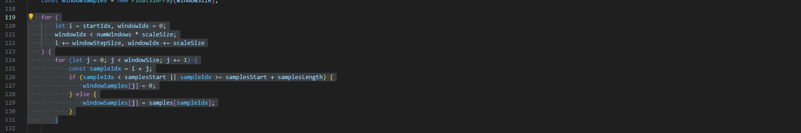

# Meticulai

This is an extension to get AI powered insights about your code.

## Features

### AI Suggestion
Highlight a snippet of code and click on the code action. You will get an AI generated diagnostic with feedback about the highlighted code.

## Requirements

You need to have a valid OpenAI API Key. You can get one from here: 

## Extension Settings

This extension contributes the following settings:
* `meticulai.openAiApiKey`: Should be set to your OpenAI API key.
* `meticulai.model`: Controls the model used for the prediction.
* `meticulai.defaultFeedbackHint`: Can be overriden to provide a hint on the content of the diagnostics.

## Known Issues

None so far.

## Release Notes

### 0.5.0

Initial release
- Includes the 'AI Suggestion' action, which provides an AI generated diagnostic based on the highlighted code.
